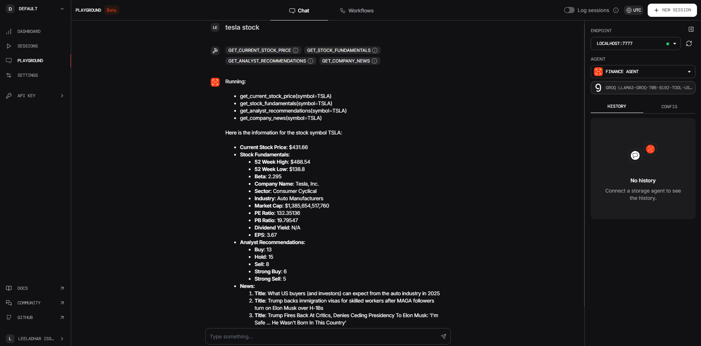

# Financial Data Agent with Phi Playground

This project demonstrates how to create an agent that fetches financial data using the Phi API and integrates it into a playground application. The agent can pull stock prices, analyst recommendations, and news for a specific company.

## Overview

In this project, we create two agents: 
1. **Web Search Agent**: Searches the web for specific information.
2. **Finance Agent**: Retrieves financial data from Yahoo Finance API, such as stock prices, analyst recommendations, and company news.

These agents are combined into a **multimodal agent** within the Phi Playground, allowing interaction with various tools.

